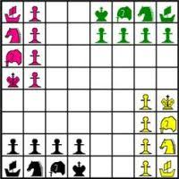
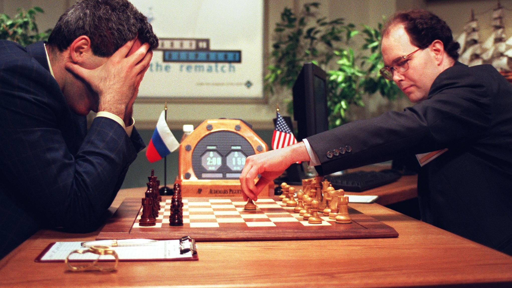

# Développement Fullstack d'une Application d'Entraînement à la Stratégie du Jeu d'Échecs
<!--veuillez lire le README.MD à la racine du projet afin de déployer la documentation-->
---

  

---

Bienvenue sur la documentation du projet **HAI606I - Projet de Programmation**.

Ce projet a pour objectif de concevoir une **application web interactive** destinée à l'entraînement aux stratégies du jeu d’échecs.  
Elle permet aux utilisateurs de se perfectionner en analysant des positions, en devinant les meilleurs coups, et en progressant grâce à un système de scores.

Réalisé dans le cadre du module HAI606I de la **Licence 3 Informatique** à l'**Université de Montpellier**, ce projet est développé par :

- Reda AMMARI — *22207235*
- Kevin HARAUT — *22104933*
- Reyam KADDOUR — *22101281*
- Dounghwi SHIN — *22110635*

**Encadrant :** Vincent BERRY

# Introduction

## L'histoire des échecs

Le jeu d’échecs, bien que datant du VIᵉ siècle, n'a jamais connu de changement fondamental dans ses règles et son fonctionnement. Son invention est souvent attribuée à l’Inde, où il était connu sous le nom de **Chaturanga**, un jeu pratiqué à la cour des rois Gupta et qui simulait une bataille entre quatre armées.  
De l’Inde, le jeu s’est diffusé vers la Perse sous le nom de **Shatranj**, où il a acquis certaines règles plus proches de celles que nous connaissons aujourd’hui. Avec l’expansion du monde islamique, il s’est propagé vers l’Europe au Moyen Âge, où il a connu des modifications importantes à la Renaissance, notamment avec l’introduction de la **reine** et du **fou**, qui ont rendu le jeu plus dynamique et stratégique [voir référence 1](#ref1).

  

Pendant plusieurs siècles, les échecs ont été l’un des jeux de stratégie les plus populaires, notamment en Europe, où ils étaient pratiqués par la noblesse et les intellectuels.  
Des joueurs célèbres, comme **François-André Danican Philidor** au XVIIIᵉ siècle, ont contribué à formaliser les premières bases de la théorie échiquéenne.  
Avec le XIXᵉ siècle et l’apparition des premiers tournois internationaux, les échecs ont pris une dimension plus compétitive, culminant avec la création du titre de **Champion du monde** en 1886 [voir référence 2](#ref2).

---

Malgré son intemporalité, l’évolution technologique a profondément transformé la manière dont le jeu est étudié et pratiqué.  
L'arrivée des ordinateurs dans les années 1950 a marqué le début d'une révolution dans la manière d’analyser les parties.  
Les premiers programmes échiquéens, bien que rudimentaires, ont posé les bases du développement futur des machines.  
Cependant, c’est dans les années 1990 que l’**intelligence artificielle** a réellement bouleversé le monde des échecs.  
En 1997, le superordinateur **Deep Blue**, développé par IBM, a battu le champion du monde **Garry Kasparov** lors d’un match historique, marquant le premier triomphe d’une machine sur un humain à ce niveau [voir référence 3](#ref3).

  

Aujourd’hui, ces outils de calcul offrent une opportunité unique : exploiter leur puissance non seulement pour permettre aux joueurs d'affronter les machines, mais aussi pour les aider à progresser.  
Grâce à l’analyse approfondie des parties, aux suggestions de coups optimaux et à l’apprentissage des stratégies avancées, il est désormais possible de perfectionner son jeu de manière bien plus efficace qu’auparavant.  
Avec l'essor des intelligences artificielles modernes comme **AlphaZero** [voir référence 4](#ref4), capables d’apprendre par elles-mêmes sans base de données humaine, le jeu d’échecs atteint un niveau de complexité jamais imaginé auparavant.

## Notre projet

C’est dans cette optique que nous développons notre **application d’entraînement aux stratégies du jeu d’échecs**, dans le cadre de notre projet de **Travaux d’Étude et de Recherche (TER)**.  
Cette plateforme interactive a pour objectif de proposer aux joueurs une nouvelle approche pédagogique : au lieu de simplement observer des parties de grands maîtres, ils devront **deviner les meilleurs coups possibles à chaque étape**.  
L’application calculera un **score de précision** qui évaluera la qualité de leurs choix et leur permettra de mieux comprendre les subtilités du jeu.

> 📝 **À intégrer plus tard** : mentionner les aspects ludiques comme les scores, le temps limité, etc.

Le développement de cette application repose sur plusieurs étapes clés :
- **Phase d’analyse des besoins** pour définir les fonctionnalités essentielles
- **Collecte et stockage de parties d’échecs** depuis Internet
- **Déroulement structuré** et interactif de la partie

> 📝 **À intégrer plus tard** : mentionner les aspects qualité logicielle (tests unitaires, documentation...).

L’application sera publiée en **open source** sur GitHub, afin de garantir une **continuité du projet**.  
L’objectif final est de concevoir une plateforme **intuitive** et **accessible à tous**, permettant aux joueurs de s’exercer tout en découvrant les raisonnements des plus grands champions.

Grâce à cette approche interactive, nous espérons offrir un **outil pédagogique efficace** qui facilitera l’apprentissage des stratégies avancées aux échecs.

---

## Références

-  **[1]** Murray, H. J. R. (1913). *A History of Chess*.
-  **[2]** Hooper, D., & Whyld, K. (2006). *The Oxford Companion to Chess*.
-  **[3]** Campbell, M., Hoane, A. J., & Hsu, F. H. (2002). *Deep Blue*.
-  **[4]** Silver, D., Hubert, T., Schrittwieser, J., et al. (2018). *AlphaZero*.
